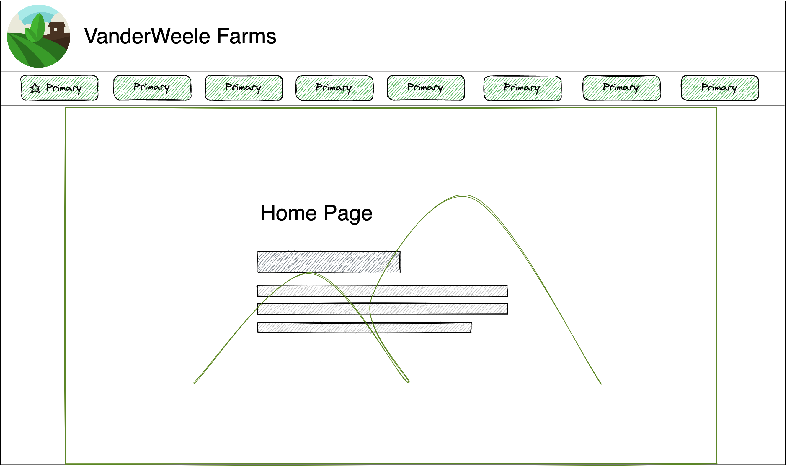
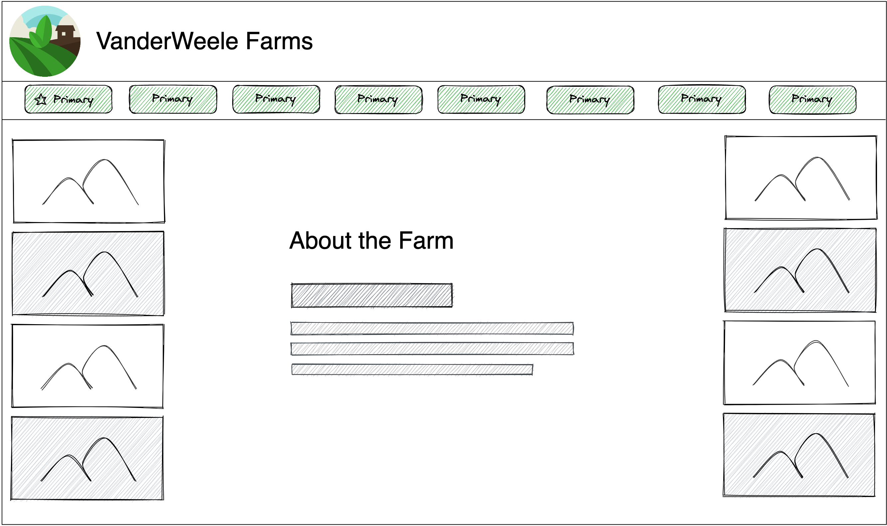
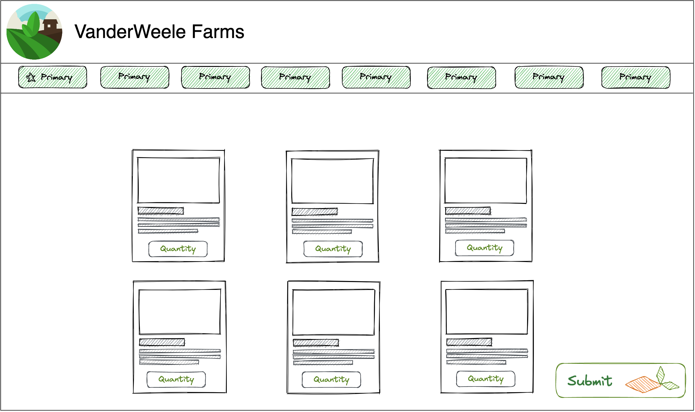
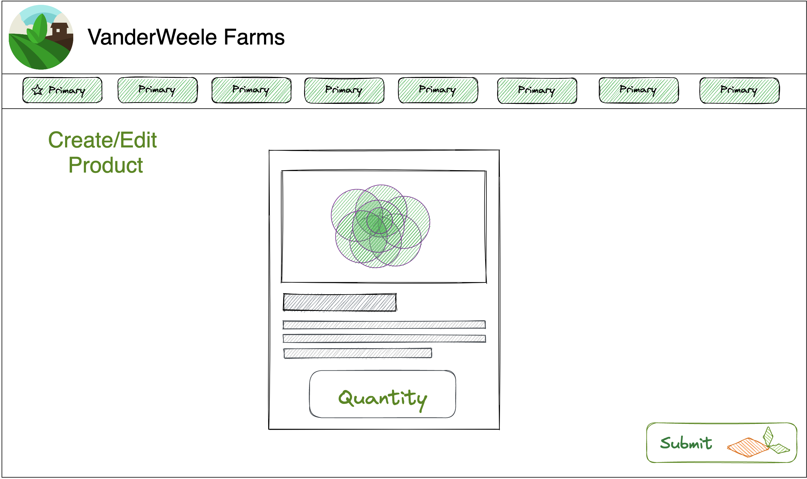
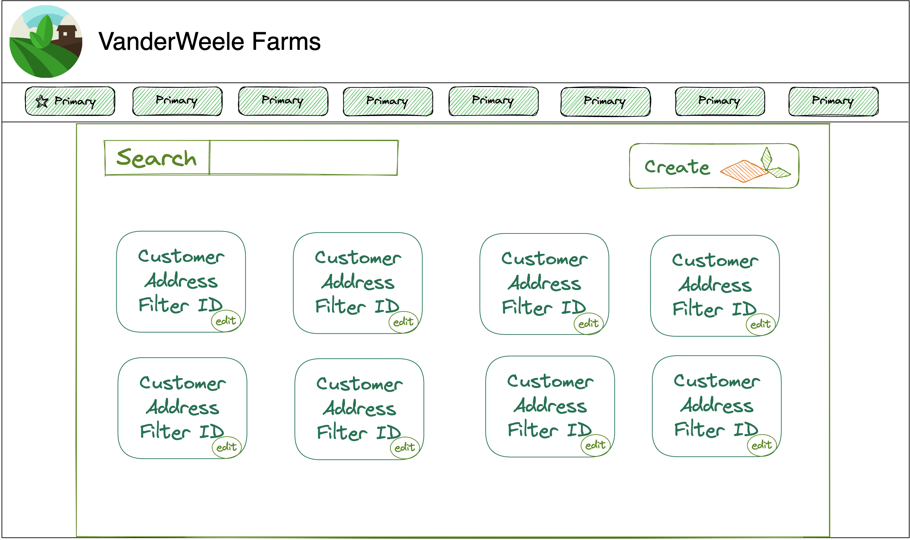

We will be creating a list of all the end points with their associated images followed by the corresponding pseudo code. 



This page will only be front end, no api calls

endpoint path: /home


This page will only have about the farm information, no api calls

endpoints: /about/person_name

person_name = {
    Ben,
    Suess,
    Roger,
    Michelle,
    Glenn,
}


### Log in

* Endpoint path: /token
* Endpoint method: POST

* Request shape (form):
  * username: string
  * password: string

* Response: Account information and a token
* Response shape (JSON):
    ```json
    {
      "account": {
        "email": string,
        "password": string,
      },
      "token": string
    }
    ```

### Log out

* Endpoint path: /token
* Endpoint method: DELETE

* Headers:
  * Authorization: Bearer token

* Response: Always true
* Response shape (JSON):
    ```json
    true
    ```


### /cart
#### get request
* Endpoint path: /listed_products/cart
* Endpoint method: "GET"


* Headers:
  * Authorization: Bearer token

* Request shape (JSON):
    ```json
        {
      "product": [
        {
          "product_name": string,
          "picture_url": string,
          "description": string,
          "quantity": number,
          
        }
      ]
    }
    ```

* Response: If response.ok
* Response shape (JSON):
    ```json
    {
      "product": [
        {
          "product_name": string,
          "picture_url": string,
          "description": string,
          "quantity": number,
          
        }
      ]
    }
    ```

#### post
* Endpoint path: /orders
* Endpoint method: "POST"


* Headers:
  * Authorization: Bearer token

* POST shape (JSON):
    ```json
        {
      "product": [
        {
          "product_name": string,
          "picture_url": string,
          "description": string,
          "quantity": number,
          
        }
      ]
    }
    ```

* Response: If response.ok
* Response shape (JSON):
    ```json
    {
      "product": [
        {
          "product_name": string,
          "picture_url": string,
          "description": string,
          "quantity": number,
          
        }
      ]
    }

### put
* Endpoint path: /orders
* Endpoint method: "PUT"


* Headers:
  * Authorization: Bearer token

* PUT shape (JSON):
    ```json
        {
      "product": [
        {
          "product_name": string,
          "picture_url": string,
          "description": string,
          "quantity": number,
          
        }
      ]
    }
    ```

* Response: If response.ok
* Response shape (JSON):
    ```json
    {
      "product": [
        {
          "product_name": string,
          "picture_url": string,
          "description": string,
          "quantity": number,
          
        }
      ]
    }
    ```



### /create_product

* Endpoint path: admin_products/
* Endpoint method: POST


* Headers:
  * Authorization: Bearer token

* Request shape (JSON):
    ```json
    {
    "product":[
        {
            "product_name": string,
            "picture_url": img_file?,
            "description": string,
            "available": bool,
            "height": int,
            "width": int,
            "length": int
        }
    ]
    }
    ```

* Response: If response.ok
* Response shape (JSON):
    ```json
    {
    "product":[
        {
            "product_name": string,
            "picture_url": img_file?,
            "description": string,
            "available": bool,
            "height": int,
            "width": int,
            "length": int
        }
    ]
    }
    ```

### update product
## /edit

* Endpoint path: /admin_products/product_id
* Endpoint method: PUT


* Headers:
  * Authorization: Bearer token

* PUT shape (JSON):
    ```json
    
* Request shape (JSON):
    ```json
    {
    "product":[
        {
            "product_name": string,
            "picture_url": string,
            "description": string,
            "available": bool,
            "height": int,
            "width": int,
            "length": int
        }
    ]
    }

    ```

* Response: if response.ok
* Response shape (JSON):
    ```json
    
    {
    "product":[
        {
            "product_name": string,
            "picture_url": string,
            "description": string,
            "available": bool,
            "height": int,
            "width": int,
            "length": int
        }
    ]
    }

    ```

### delete product
## /delete

* Endpoint path: /admin_products/delete
* Endpoint method: DELETE


* Headers:
  * Authorization: Bearer token

* DELETE shape (JSON):
    ```json
    
* Request shape (JSON):
    ```json
    {
    "product":[
        {
            "product_name": string,
            "picture_url": string,
            "description": string,
            "available": bool,
            "height": int,
            "width": int,
            "length": int
        }
    ]
    }

    ```

* Response: if response.ok
* Response shape (JSON):
    ```json
    
    {
    "product":[
        {
            "product_name": string,
            "picture_url": string,
            "description": string,
            "available": bool,
            "height": int,
            "width": int,
            "length": int
        }
    ]
    }

    ```



### customer_info_page

#### GET
* Endpoint path: /customer_info_page/
* Endpoint method: "GET"


* Headers:
  * Authorization: Bearer token

* Request shape (JSON):
    ```json
        {
      "customer": [
        {
          "customer_name": string,
          "customer_location": string,
          "customer_email": string?,
          "driver_id": int,
          "priority_id": int,
          
        }
      ]
    }
    ```

* Response: If response.ok
* Response shape (JSON):
    ```json
    {
      "customer": [
        {
          "customer_name": string,
          "customer_location": string,
          "customer_email": string?,
          "driver_id": int,
          "priority_id": int,
          
        }
      ]
    }
    ```

#### PUT
* Endpoint path: /customer_info_page/customer_id
* Endpoint method: "PUT"


* Headers:
  * Authorization: Bearer token

* Request shape (JSON):
    ```json
        {
      "customer": [
        {
          "driver_id": int,
          "priority_id": int,
          
        }
      ]
    }
    ```

#### DELETE
* Endpoint path: /customer_info_page/
* Endpoint method: "DELETE"


* Headers:
  * Authorization: Bearer token

* Request shape (JSON):
    ```json
        {
      "customer": [
        {
          "customer_name": string,
          "customer_location": string,
          "customer_email": string?,
          "driver_id": int,
          "priority_id": int,
          
        }
      ]
    }
    ```

* Response: If response.ok
* Response shape (JSON):
    ```json
    {
      "customer": [
        {

        }
      ]
    }
    ```


* Response: If response.ok
* Response shape (JSON):
    ```json
    {
      "customer": [
        {
          "driver_id": int,
          "priority_id": int,
          
        }
      ]
    }
    ```

### new_customer 
#### post
* Endpoint path: /customer_info_page/
* Endpoint method: "POST"


* Headers:
  * Authorization: Bearer token

* POST shape (JSON):
    ```json
        {
      "customer": [
        {
          "customer_name": string,
          "customer_address": string,
          "customer_email": string,
          "driver_id": number,
          "priority_id": number,
          
        }
      ]
    }
    ```

* Response: If response.ok
* Response shape (JSON):
    ```json
    {
      "customer": [
        {
          "customer_name": string,
          "customer_address": string,
          "customer_email": string,
          "driver_id": number,
          "priority_id": number,
          
        }
      ]
    }
    ```


#### product_page.png

### Add_Product_to_Cart

* Endpoint path: /listed_products/cart
* Endpoint method: PUT

* Headers:
  * Authorization: Bearer token

* Response: Product added to cart
* Response shape:
    ```json
    {
      "product_id": [
        {
          "product_name": string,
          "picture_url": string,
          "description": string,
          "quantity": number,
          
        }
      ]
    }
    ```


### Listed_Products

* Endpoint path: /listed_products/
* Endpoint method: GET

* Headers:
  * Authorization: Bearer token

* Response: All available products
* Response shape:
    ```json
    {
      "all_avaible_products": [
        {
          "product_name": string,
          "picture_url": string,
          "description": string,
          
          
        }
      ]
    }
    ```


#### orders_page.png

### Listed_Orders

* Endpoint path: /orders
* Endpoint method: GET

* Headers:
  * Authorization: Bearer token

* Response: All Orders Placed
* Response shape:
     ```json
    {
      "all_orders_placed": [
        {
        "customer":[
          "customer_name": string,
          "customer_location": string,
        ],
        "product": [
          "product_name":string,
          "product_quantity":number,
        ],
          
        }
      ]
    }
    ```


### New_Driver

* Endpoint path: /drivers
* Endpoint method: POST

* Headers:
  * Authorization: Bearer token

* Response: Create New Driver
* Response shape:
    ```json
    {
      "drivers": [
        {
            "driver_name": string,
            "driver_id": int,
        }
      ]
    }
    ```

### Get_Driver_List

* Endpoint path: /drivers
* Endpoint method: GET

* Headers:
  * Authorization: Bearer token

* Response: List of Drivers
* Response shape:
    ```json
    {
      "drivers": [
        {
            "driver_name": string,
            "driver_id": int,
        }
      ]
    }
    ```


### Get_Driver_Details

* Endpoint path: /driver
* Endpoint method: GET

* Headers:
  * Authorization: Bearer token

* Response: Get Driver Details
* Response shape:
    ```json
    {
      "drivers": [
        {
            "driver_name": string,
            "driver_id": int,
        }
      ]
    }
    ```

### Edit_Driver

* Endpoint path: /driver/id
* Endpoint method: PUT

* Headers:
  * Authorization: Bearer token

* Response: Edit Driver Details
* Response shape:
    ```json
    {
      "drivers": [
        {
            "driver_name": string,
            "driver_id": int,
        }
      ]
    }
    ```

### Delete_Driver
* Endpoint path: /driver/id
* Endpoint method: DELETE

* Headers:
  * Authorization: Bearer token

* Response: Delete Driver
* Response shape:
    ```json
    {
      "drivers": [
        {
            "driver_name": string,
            "driver_id": number,
        }
      ]
    }
    ```